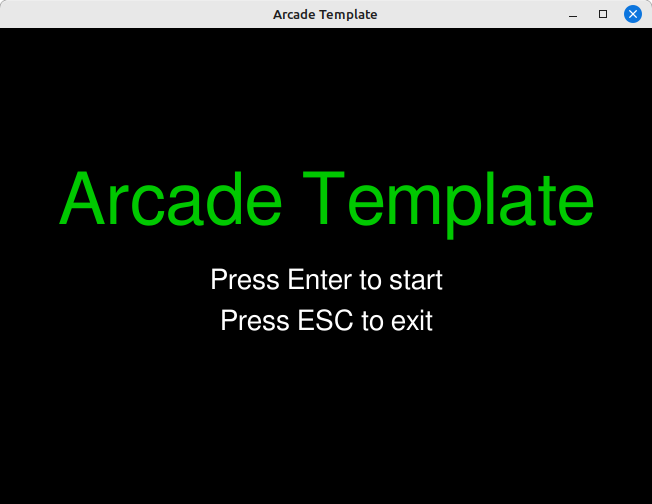

# ArcadeTemplate

So, you want to recreate a classic arcade game using pygame-ce, but you don't want to do it entirely from scratch?
Good news! This template is a solid starting point.



## Features

- Resizable window with `F11` fullscreen mode toggle
- Simple state machine with template (text-only placeholder) states:
  - Title Screen
  - Game Mode
  - Pause Mode
  - Game Over Mode
  - Test Mode
- Optional audio handling via an `audio.json` file (not an error if it doesn't exist)

## Building a game

There are TODO comments in the code indicating where your code should go. Mostly, this involves
implementing the actual Game Mode, and the rules for transitioning to Game Over mode. You can
add additional states by adding to the game state enum, and handling the transitions between
your new states.

## Adding audio

You can define an `audio.json` to be packaged in the same directory as your game.
The structure is a Json array of mappings:

```json
{
  [
    {
      "gameEvent": "UNIQUE_EVENT_CODE1",
      "audio": "/path/to/audio1.wav"
    },
    {
      "gameEvent": "UNIQUE_EVENT_CODE2",
      "audio": "/path/to/audio2.wav"
    }
  ]
}
```

Each `gameEvent` references an audio file, which can either have a relative path (relative to the directory that
contains the python script) or an absolute path. All audio is eagerly loaded on startup and cached.

This template adds support for the following game events:

- `startup`: palyed when program starts up (except in Test Mode as noted above).
- `newGame`: played on transition from Title Screen Mode to Game Mode
- `pause`: played on transition from Game Mode to Pause Mode
- `unpause`: played on transition from Pause Mode to Game Mode

You can add your own game events to this list quite easily:

```
# Recognised game-event codes (keys into the audio cache)
SUPPORTED_GAME_EVENTS: set[str] = {
    "startup", // built-in
    "newGame", // built-in
    "pause",   // built-in
    "unpause", // built-in
    "myNewGameEvent" // custom!
}
```

Then you can invoke `audio.play("myNewGameEvent")` to play your custom audio.

## Command-line options

This template provides support for the following command-line arguments:

- `--width WIDTH` - Starting window width (minimum 640, default 800)
- `--height HEIGHT` - Starting window height (minimum 480, default 600)
- `--fullscreen` - Start in fullscreen mode.
- `--test` - Run a quick smoke-test and exit.
- `--nosound` - Disable all audio.

Argument parsing is done with standard `argparse`. Adding your own arguments to 
this list should be straightforward.

